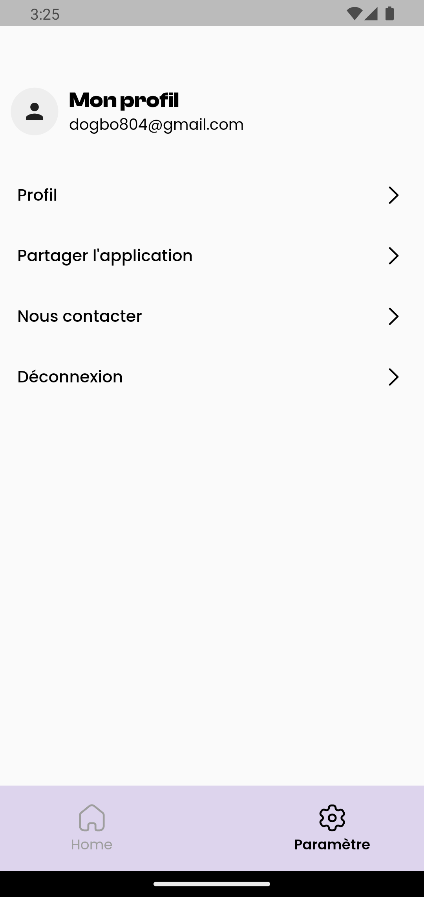

# ParkManager

ParkManager est une application de gestion des parkings conçue pour les clients B2B tels que Vinci, Indigo, etc. L'application permet aux utilisateurs publics de trouver des places de parking disponibles et offre aux entreprises une vue d'ensemble de leur parking, y compris le taux d'occupation et les temps d'utilisation.

## Fonctionnalités

- **Login et inscription utilisateur** : Les utilisateurs peuvent s'inscrire et se connecter en tant qu'administrateur ou utilisateur public.
- **Gestion des utilisateurs** : Les administrateurs peuvent lire, mettre à jour et supprimer les informations des utilisateurs.
- **Gestion des places de parking** : Les administrateurs peuvent créer des places de parking avec un numéro de place, un étage, une disponibilité et un temps d'occupation. Ils peuvent également assigner ou désassigner des places de parking à des utilisateurs.
- **Recherche de places libres** : Les utilisateurs publics peuvent rechercher des places de parking disponibles par étage.
- **Recherche de places par utilisateur** : Les utilisateurs peuvent retrouver la place où ils ont garé leur voiture.
- **Onboarding** : L'application présente ses fonctionnalités clés à travers des écrans d'onboarding.
- **Compte de test** : 
Admin -> jean@gmail.com  pwd: 111111
Public user -> dogbo804@gmail.com pwd: 111111

- **Pour installer le .apk** :build/app/outputs/flutter-apk/parkmanager.apk

## Capture d'écran

## Configuration

Avant de commencer à utiliser l'application, assurez-vous de configurer Firebase et d'ajouter les clés d'API nécessaires.

## Technologies utilisées

- Flutter : Framework de développement d'applications multiplateformes.
- Firebase : Plateforme de développement d'applications mobiles et web.
- Firestore : Base de données NoSQL en temps réel.

## Installation

1. Clonez le dépôt GitHub.
2. Vérifier la config Firebase.
3. Exécutez l'application avec `flutter run`.

